# ImportCost Pro

Aplicación ASP.NET Core 9 MVC con Entity Framework Core para que una empresa importadora registre órdenes de importación con varios productos y calcule el **landed cost** de cada uno: el costo real de un producto puesto en almacén local, considerando valor FOB, flete y seguro internacional, tasa de cambio, arancel, impuesto selectivo, tasa de servicio aduanal, ITBIS, gastos locales y margen de ganancia.

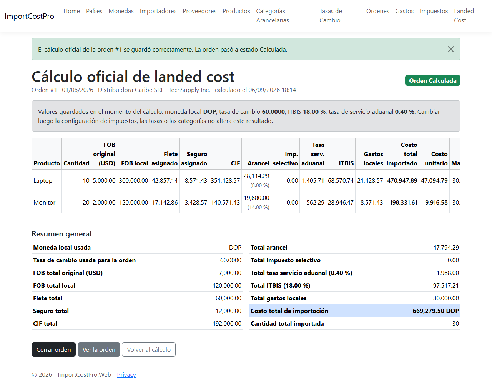

## Módulos

- **Mantenimientos** de países, monedas (con una única moneda local), importadores, proveedores, productos (peso, dimensiones y categoría arancelaria, sin precio FOB), categorías arancelarias (arancel, ITBIS e impuesto selectivo) y tasas de cambio por par de monedas y fecha de vigencia. Códigos ISO únicos y en mayúscula, registros activos e inactivos, y eliminación bloqueada cuando el registro está en uso.
- **Configuración de impuestos**: porcentaje general de ITBIS y tasa de servicio aduanal, capturados como valores visibles entre 0 y 100.
- **Órdenes de importación** con importador, proveedor, moneda y estado (Abierta, Calculada, Cerrada, Cancelada). Detalle de la orden con productos, gastos y resultado oficial en una sola pantalla.
- **Productos de la orden**: cantidad, precio FOB unitario y margen deseado por producto. Solo se modifican mientras la orden está Abierta.
- **Gastos de importación**: flete internacional, seguro internacional y gastos locales, cada uno con su moneda, fecha y método de distribución (por valor FOB, peso, volumen o cantidad).
- **Cálculo de landed cost**: selección de orden abierta, validaciones previas con mensajes precisos, vista previa del resultado, guardado del cálculo oficial y bloqueo de recálculo.
- **Confirmación y cierre**: una orden Calculada se cierra con confirmación; una orden cerrada solo se consulta.

## Cómo se calcula el landed cost

1. FOB por producto (`cantidad × precio FOB`) y FOB total de la orden.
2. Conversión del FOB a moneda local con la tasa activa más reciente cuya vigencia sea menor o igual a la fecha de la orden (tasa 1 si la orden ya está en moneda local).
3. Conversión de cada gasto a moneda local con la tasa vigente a la fecha del gasto.
4. Bases de distribución: FOB local, peso, volumen y cantidad totales, validadas solo si algún gasto las usa.
5. Prorrateo de cada gasto según su método de distribución; flete y seguro se separan de los gastos locales.
6. CIF por producto = FOB local + flete asignado + seguro asignado.
7. Arancel e impuesto selectivo sobre el CIF según la categoría arancelaria; tasa de servicio aduanal sobre el CIF según la configuración.
8. ITBIS sobre CIF + arancel + impuesto selectivo + tasa de servicio, solo si la categoría aplica ITBIS.
9. Costo total importado, costo unitario y precio de venta sugerido = costo unitario / (1 − margen / 100).

Todos los montos se manejan en `decimal` con precisión completa y se redondean a dos decimales solo al mostrarse. El resultado oficial guarda una copia de la moneda local, la tasa de cambio, los porcentajes de impuestos y de cada categoría, y los gastos asignados por producto, de modo que cambiar luego una tasa, una categoría o la configuración no altera los cálculos históricos.

Con el ejemplo del documento funcional (orden en USD a 60 DOP, laptop 10 × 500 al 8 % y monitor 20 × 100 al 14 %, flete 1,000 USD, seguro 200 USD, gastos locales 30,000 DOP, ITBIS 18 %, tasa aduanal 0.4 %, margen 30 %) el sistema obtiene el costo total de importación de **669,279.50 DOP** que indica el enunciado.

## Reglas de negocio implementadas

- Los registros inactivos no aparecen en los formularios de creación, pero se conservan en el histórico.
- No se elimina un país, moneda, importador, proveedor, producto, categoría o tasa que esté en uso; se sugiere inactivarlo.
- Solo hay una moneda local y no puede desactivarse ni eliminarse.
- El cálculo exige orden Abierta con productos, moneda válida, moneda local activa, configuración de impuestos, gasto de flete y de seguro, tasas de cambio válidas para la orden y para cada gasto en moneda extranjera, categoría arancelaria por producto, y peso, dimensiones o cantidad cuando el método de distribución lo requiere.
- El margen deseado es mayor o igual que 0 y menor que 100.
- Solo se guarda un cálculo oficial por orden. Al guardarlo la orden pasa a Calculada y sus datos, productos y gastos quedan bloqueados.
- Cerrar exige estado Calculada, resultado oficial con costo mayor que 0 y productos registrados; el cierre no recalcula ni modifica el resultado.
- Una orden con cálculo oficial no se elimina; puede cancelarse mientras no esté cerrada.

## Capturas

| Inicio | Detalle de una orden abierta |
|---|---|
| 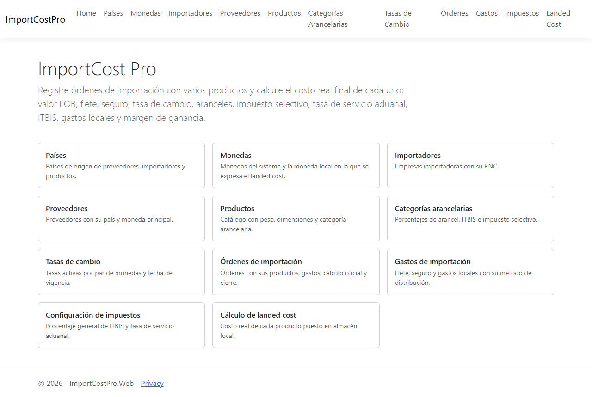 | 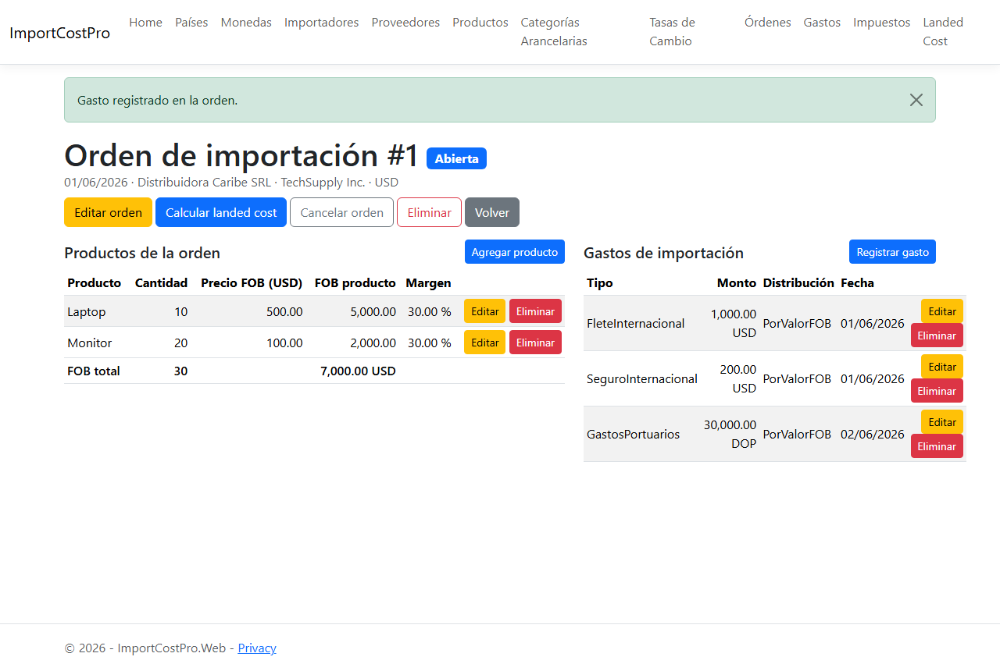 |

| Selección de orden para calcular | Vista previa del cálculo |
|---|---|
| 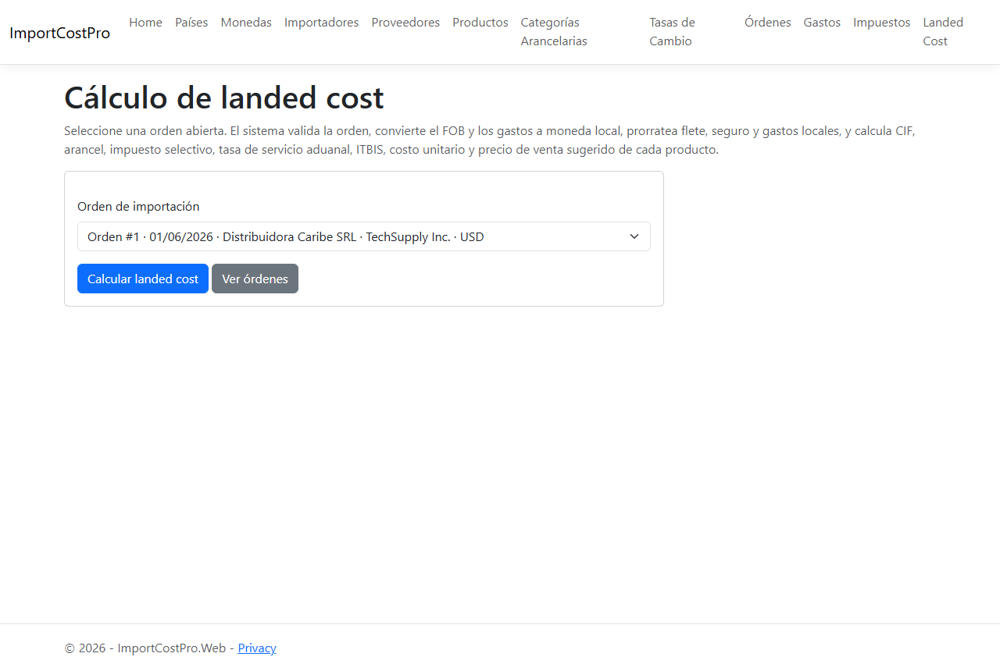 | 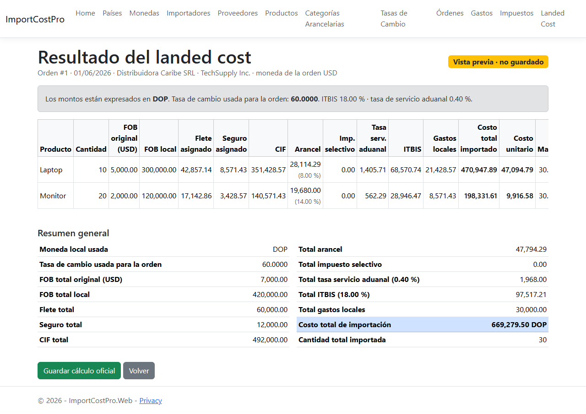 |

| Confirmación de cierre | Orden cerrada con su resultado oficial |
|---|---|
| 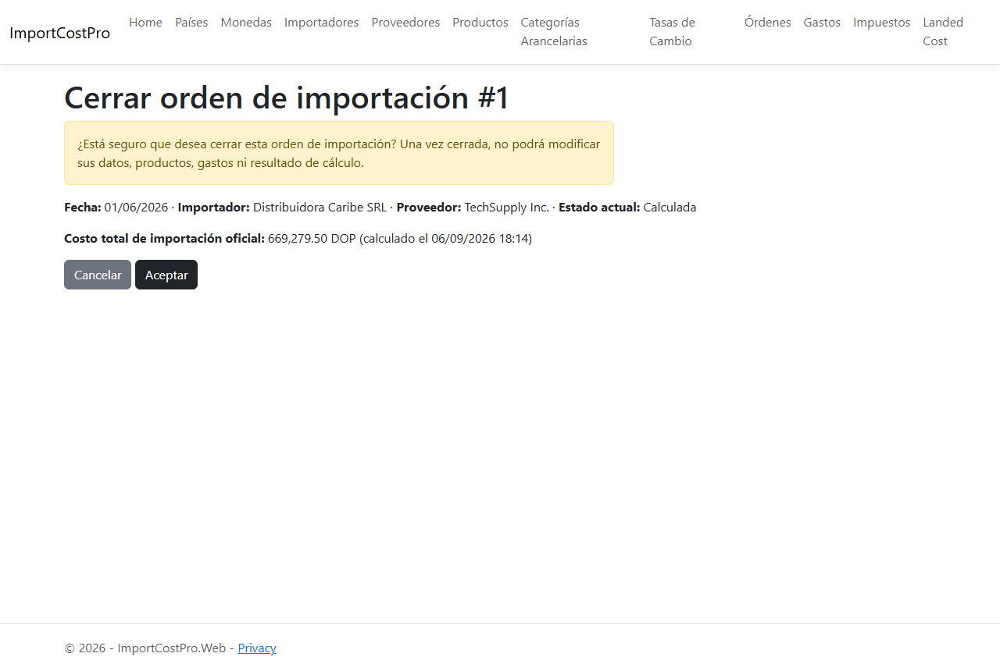 | 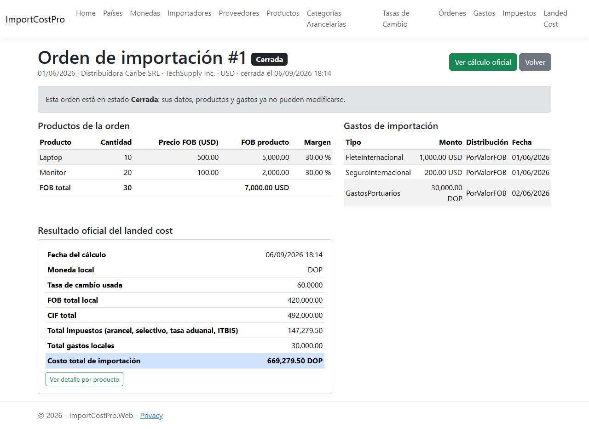 |

| Validación previa al cálculo | Validación de productos de la orden |
|---|---|
| 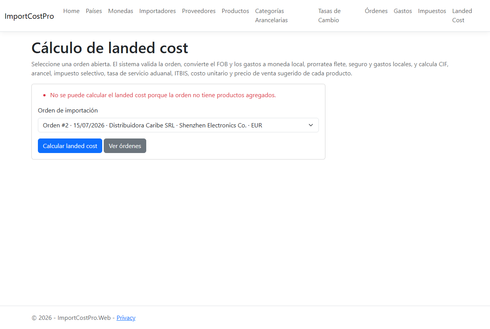 | 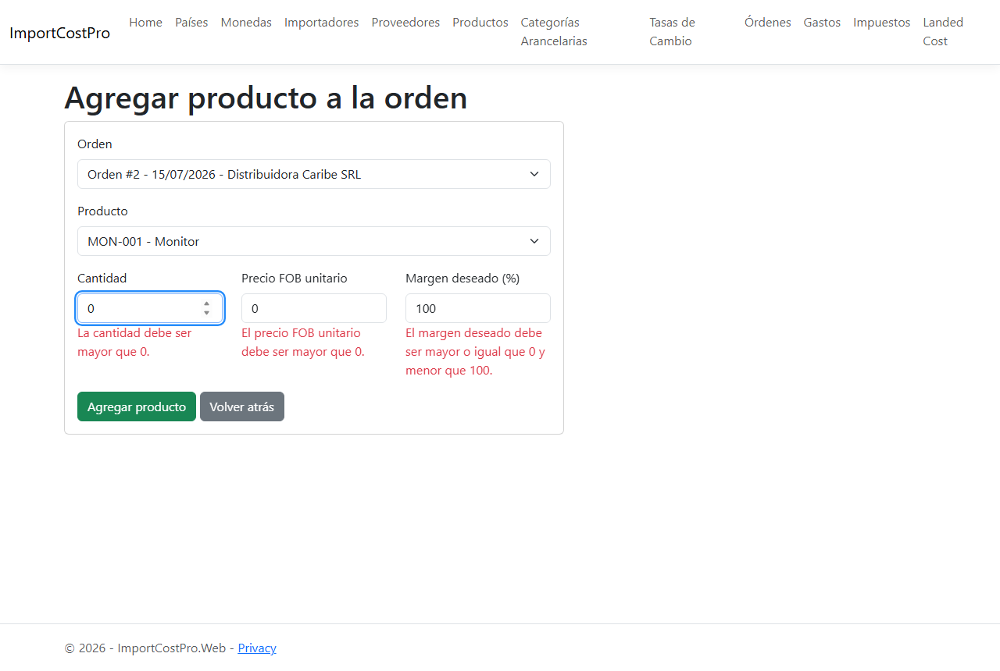 |

| País con código ISO duplicado | Tasa usada en un cálculo oficial |
|---|---|
| 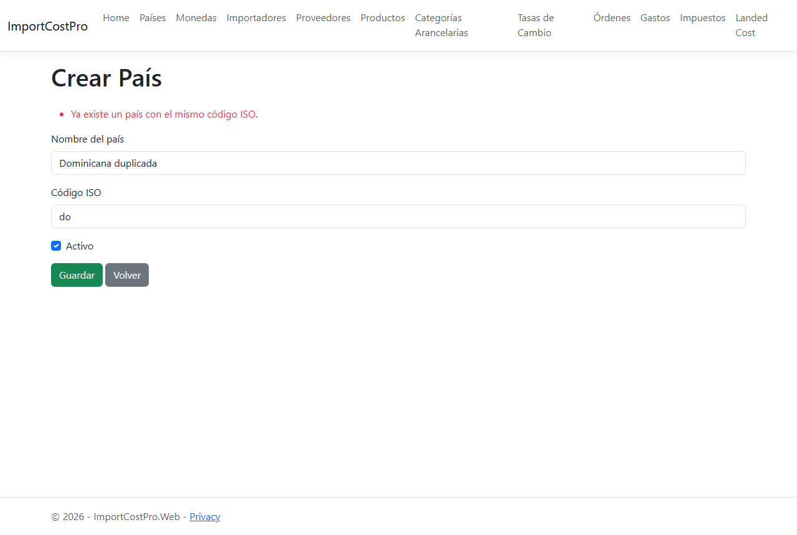 | 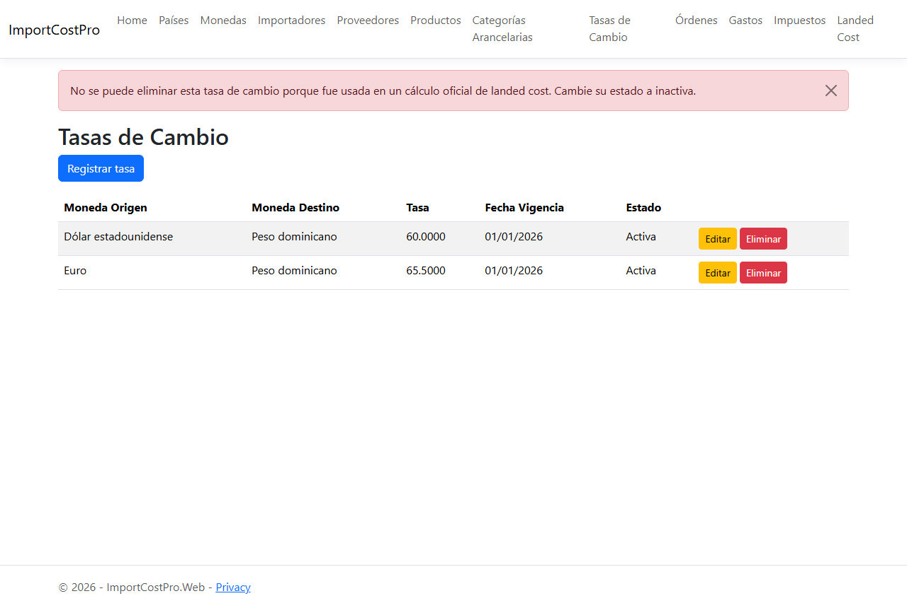 |

Más capturas en [`docs/`](docs): listados de países, monedas, productos, categorías, tasas, configuración de impuestos, órdenes, formularios de creación y la orden bloqueada tras el cálculo.

## Arquitectura

```
ImportCostPro.sln
├── ImportCostPro.Core   Entidades, enums, DbContext y migraciones, DTOs, interfaces y servicios
│                        (mantenimientos, órdenes, productos y gastos de la orden, landed cost)
└── ImportCostPro.Web    MVC: controladores, view models con validaciones, vistas Razor y Bootstrap
```

- Toda la lógica de negocio y el cálculo del landed cost viven en los servicios de `Core`; los controladores solo coordinan, capturan los errores de negocio y muestran mensajes.
- Los formularios usan view models con validación del lado del servidor y del cliente.
- Persistencia con EF Core Code First: 14 migraciones, relaciones con claves foráneas, precisión `decimal` configurada para montos, tasas y porcentajes.

## Cómo ejecutarlo

Requisitos: SDK de .NET 9 y SQL Server. La cadena de conexión por defecto apunta a la instancia local `.` con autenticación integrada; ajústala en `ImportCostPro.Web/appsettings.json` o con la variable de entorno `ConnectionStrings__DefaultConnection`.

```bash
git clone https://github.com/MarioMahir/ImportCostPro.git
cd ImportCostPro
dotnet ef database update --project ImportCostPro.Core --startup-project ImportCostPro.Web
dotnet run --project ImportCostPro.Web --launch-profile https
```

La app queda en https://localhost:7279. Para probar el cálculo hacen falta al menos una moneda local, una tasa de cambio, una categoría arancelaria, un producto, un importador, un proveedor y la configuración de impuestos; todo se registra desde los mantenimientos.

## Contexto

Mini proyecto del módulo de Programación III (ITLA, 2026), desarrollado según el documento funcional y la plantilla de evaluación de la práctica.
